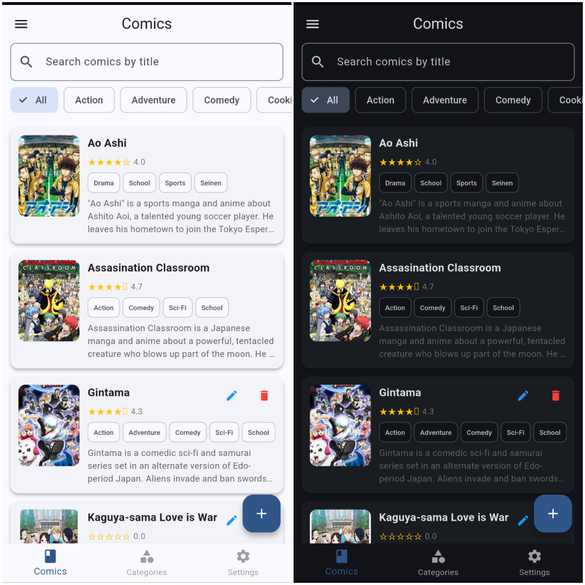
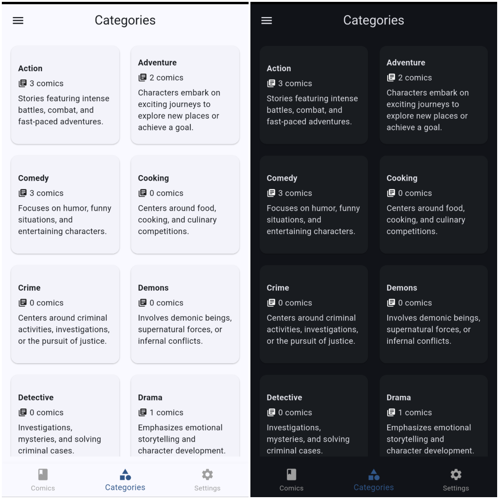
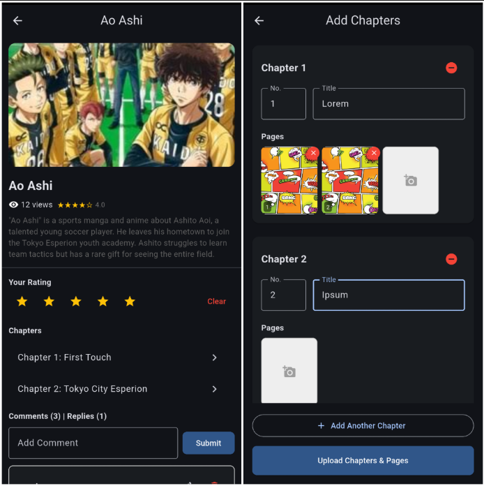

<header id="readme-top">
  <div align="center">
    
    <h1>Komiku*</h1>
    <p><i>*The name is used solely as a project identifier. Any resemblance to existing names, trademarks, brands, or copyrighted works is unintentional. All rights remain with their respective owners.</i></p>
    <p>A fun and challenging memory game.</p>
    <p>
      Test your memory by matching sequences of images, track your high scores, 
      and customize your experience in this engaging mobile application.
    </p>
    <a href="#installation">Installation</a>
    &middot;
    <a href="#commands">Commands</a>
    &middot;
    <a href="#demo">Demo</a>
    <br><br>
    
    
    
    
  </div>
</header>

<hr>

<details>
  <summary>Table of Contents</summary>
  <ol>
    <li><a href="#overview">Overview</a></li>
    <li><a href="#structure">Structure</a></li>
    <li><a href="#prerequisites">Prerequisites</a></li>
    <li><a href="#installation">Installation</a></li>
    <li><a href="#usage">Usage</a></li>
    <li><a href="#commands">Commands</a></li>
    <li><a href="#demo">Demo</a></li>
    <li><a href="#license">License</a></li>
    <li><a href="#acknowledgments">Acknowledgments</a></li>
  </ol>
</details>

<section id="overview">
  <header>
    <h2>Overview</h2>
  </header>
  <p>
    Memorimage is a memory-based game application that challenges users to remember and identify
    images shown in sequence. It provides a simple yet engaging user experience with features
    like player profiles, real-time scoring, and persistent high scores.
  </p>
  <p>
    The project is built using Flutter, demonstrating state management, local data persistence
    with SharedPreferences, and custom UI components with smooth animations.
  </p>
  <p align="right"><a href="#readme-top">Back to top</a></p>
</section>

<br>

<a id="structure"></a>

## Structure

<pre><code>memorimage/
├── lib/
│   ├── components/        # Reusable UI widgets (AppBar, Drawer, etc.)
│   ├── models/            # Data models
│   ├── pages/             # App screens (Game, Login, Highscore, etc.)
│   ├── services/          # Logic and services
│   ├── utils/             # Theme and helper functions
│   └── main.dart          # Entry point and routing
├── assets/                # Images and fonts
├── pubspec.yaml           # Dependencies and project config
└── README.md</code></pre>
<p>
  The project follows a standard Flutter directory structure, separating UI components, 
  business logic, and data models to maintain a clean and scalable codebase.
</p>
<p align="right"><a href="#readme-top">Back to top</a></p>

<br>

<section id="prerequisites">
  <header>
    <h2>Prerequisites</h2>
  </header>
  <ul>
    <li>Flutter SDK (latest stable version)</li>
    <li>Dart SDK</li>
    <li>Android Studio / VS Code with Flutter extension</li>
    <li>A physical device or emulator for testing</li>
  </ul>
  <p align="right"><a href="#readme-top">Back to top</a></p>
</section>

<br>

<a id="installation"></a>

## Installation

1. Clone the repository.

```sh
git clone <REPOSITORY_URL>
cd memorimage
```

2. Install dependencies.

```sh
flutter pub get
```

3. Run the application.

```sh
flutter run
```

<p align="right"><a href="#readme-top">Back to top</a></p>

<br>

<section id="usage">
  <header>
    <h2>Usage</h2>
  </header>
  <ul>
    <li>Enter your player name to log in and start your session.</li>
    <li>Click "Play Game" from the home screen to begin a new round.</li>
    <li>Watch the images carefully and remember their sequence or pairs.</li>
    <li>Select the correct images to earn points and advance.</li>
    <li>Check the "Highscore" page via the drawer to see the top players.</li>
    <li>Customize your experience through the game settings (if available).</li>
  </ul>
  <p align="right"><a href="#readme-top">Back to top</a></p>
</section>

<br>

<section id="commands">
  <header>
    <h2>Commands</h2>
  </header>
  <table>
    <thead>
      <tr>
        <th>Command</th>
        <th>Description</th>
      </tr>
    </thead>
    <tbody>
      <tr>
        <td><code>flutter pub get</code></td>
        <td>Fetch and install project dependencies.</td>
      </tr>
      <tr>
        <td><code>flutter run</code></td>
        <td>Run the app in debug mode on a connected device.</td>
      </tr>
      <tr>
        <td><code>flutter build apk</code></td>
        <td>Build a production APK for Android.</td>
      </tr>
      <tr>
        <td><code>flutter analyze</code></td>
        <td>Run static analysis to check for issues in the code.</td>
      </tr>
    </tbody>
  </table>
  <p align="right"><a href="#readme-top">Back to top</a></p>
</section>

<br>

<section id="demo">
  <header>
    <h2>Demo</h2>
  </header>

  <p align="center">
    
  </p>

  <p align="center">
    Home Page
  </p>

  <br>

  <p align="center">
    
  </p>

  <p align="center">
    Category Page
  </p>

  <br />

  <p align="center">
    
  </p>

  <p align="center">
    Comic Page
  </p>

  <br />

  <p align="right">
    <a href="#readme-top">Back to top</a>
  </p>
</section>

<br>

<section id="license">
  <header>
    <h2>License</h2>
  </header>
  <p>Distributed under the MIT License. See <code>LICENSE</code> for more information.</p>
  <p align="right"><a href="#readme-top">Back to top</a></p>
</section>

<br>

<section id="acknowledgments">
  <header>
    <h2>Acknowledgments</h2>
  </header>
  <ul>
    <li>Freepik for the illustration asset.</li>
  </ul>
  <p align="right"><a href="#readme-top">Back to top</a></p>
</section>
